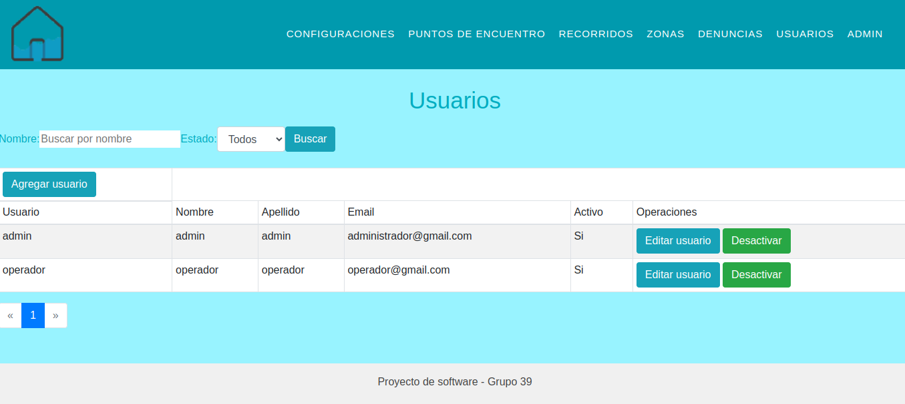
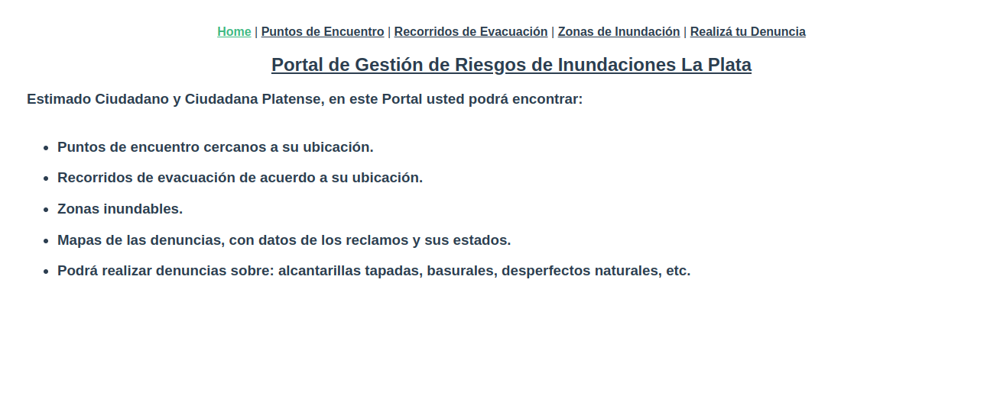
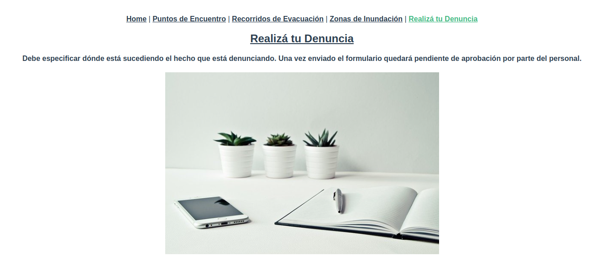

# Flooding

## Introduction

An application must be created to monitor and manage flood-prone areas and the actions to be taken. The focus should be on developing a prototype that provides information to the inhabitants of the city of La Plata about:
- Flood-prone areas in the city;
- Meeting points in case of an emergency;
- Evacuation routes.

Additionally, users will be able to report blocked drains and garbage dumps.

## Objective

Two applications will be implemented to manage and provide the mentioned information. On one hand, a private application will be developed with the following functionalities:
- User management for the system.
- System configuration options maintenance.
- Management of flood-prone areas.
- Management of meeting points established by the municipality.
- Processing of reported issues.

A public application will also be developed, allowing citizens to view relevant information. Through this application, users will be able to:
- View flood-prone areas.
- Locate meeting points established by the municipality, with the option to display the nearest ones to the user's location.
- Report issues such as blocked drains and garbage dumps. Other types of reports that may be relevant can also be considered.
- View evacuation routes based on the user's location.

## Configuration

The `.env` file is a configuration file used to store environment variables in your project. Environment variables are values used to configure and personalize the application without hardcoding values directly into the source code. This provides greater security and flexibility, as you can change the configuration without modifying the code. The steps are as follows:

1. Install databases: install MySQL Server and MySQL Workbench.

2. Create the file: In the root of your project, create a file named `.env`.

3. Define the environment variables: Within the `.env` file, define the necessary environment variables for your project. Each variable is defined on a separate line and follows the format NAME=VALUE. For this case:

    ```
    DB_HOST=my_host
    DB_PORT=my_port
    DB_USER=my_user
    DB_PASS=my_pass
    DB_NAME=my_db_name
    FLASK_ENV=development
    FLASK_DEBUG=1
    ```

## Virtual Environment: Virtualenv

Virtualenv is a tool for managing versions. The idea of using such tools includes:

* Installing virtually any version of Python (or any language).
* Allowing multiple versions to be installed.

As a preliminary step, we need to install the necessary dependencies:

Update and install required dependencies:

    ```
    sudo apt-get update;
    ```

    ```
    sudo apt-get install make build-essential libssl-dev zlib1g-dev \ libbz2-dev libreadline-dev libsqlite3-dev wget curl llvm \ libncursesw5-dev xz-utils tk-dev libxml2-dev libxmlsec1-dev libffi-dev liblzma-dev
    ```

Install pyenv:

    ```
    mkdir $HOME/.pyenv
    ```

    ```
    git clone https://github.com/pyenv/pyenv.git ~/.pyenv
    ```

    ```
    echo 'export PYENV_ROOT="$HOME/.pyenv"' >> ~/.bashrc
    ```

    ```
    echo 'export PATH="$PYENV_ROOT/bin:$PATH"' >> ~/.bashrc
    ```

    ```
    echo -e 'if command -v pyenv 1>/dev/null 2>&1; then\n eval "$(pyenv init -)"\nfi' >> ~/.bashrc
    ```

Finally:

    ```
    exec "$SHELL"
    ```

    ```
    pyenv install --list // shows the list of versions to install
    ```

    ```
    pyenv install 3.x.x // preferred version
    ```

    ```
    pyenv versions // shows installed versions and the system version
    ```

    ```
    pyenv global 3.x.x
    ```

Verify:

    ```
    python
    ```

## Create a Virtual Environment

We need to ensure that `pip` points to `pyenv` and verify that `pip` belongs to the Python version we have set as global:

    ```
    pyenv global 3.x.x
    ```

Navigate to your project directory and type `python --version`. The selected Python version should appear. Now, create a virtual directory called `venv` for the Python version you configured as global:

    ```
    pip install virtualenv
    ```

    ```
    virtualenv -p python venv
    ```

## How to Use the Virtual Environment

To activate the environment, execute:

    ```
    source venv/bin/activate
    ```

It is necessary to deactivate if we want to return to the globally installed Python:

    ```
    deactivate
    ```

## Install and Configure MySQL Server

1. Update system repositories:

    ```
    sudo apt update
    ```

2. Install MySQL server:

    ```
    sudo apt-get install mysql-server
    ```

3. Check the status of the MySQL service:

    ```
    systemctl status mysql
    ```

4. Configure the MySQL server:

    ```
    sudo mysql_secure_installation
    ```

You will be asked to configure the password validation policy level in the configuration manual. Choose "No" to avoid configuring it and to allow simple passwords. Then, answer "Yes" to all other questions.

5. Access the MySQL server:

    ```
    sudo mysql
    ```

6. Set the password for root:

    ```
    ALTER USER 'root'@'localhost' IDENTIFIED WITH mysql_native_password BY 'root';
    ```

Replace `root` with your password.

7. Install MySQL Workbench Community:

    ```
    sudo snap install mysql-workbench-community
    ```

8. Exit the MySQL console:

    ```
    exit;
    ```

## Images







## Steps to Use the Project

1. Clone the repository:

    ```
    git clone git@github.com:agustinsalum/flooding.git
    ```

2. Navigate to the cloned folder:

    ```
    cd flooding
    ```

3. Install dependencies:

    ```
    pip install -r requirements.txt
    ```

Make sure to activate the virtual environment before installing the dependencies. If you encounter an error with the "psycopg2" dependency, resolve it with `sudo apt install libpq-dev build-essential`.

## Start the Project (Private Part)

In the private part, operators accept or reject reports submitted publicly by citizens. Once configuration and virtual environment setup are complete, you can start the project. To start the project, simply enter the following command in the terminal:

    ```
    flask run
    ```

You should see the message 'Debug mode: on' and a production warning. Note that the first run may take longer as the database, tables, and corresponding attributes are being created.

## Start the Project (Public Part)

In the public part, citizens submit reports. It was built with Vue.js, and to get it running, follow these steps:

1. Navigate to the folder:

    ```
    cd web
    ```

2. Install:

    ```
    npm install
    ```

    ```
    npm install axios
    ```

    ```
    npm install leaflet
    ```

3. Install version 12 of nvm. Then enter:

    ```
    nvm use 12
    ```

4. Start:

    ```
    npm run serve
    ```

## Start the Project (Public and Private Parts)

To create a report and reflect it in the administration part, both must be started at the same time. To do this, open 2 terminals in your favorite code editor and start the server in both.

## List of Endpoints for Postman

You can test if the endpoints work in Postman. To do this:

1. Download Postman:

    ```
    https://www.postman.com/downloads/
    ```

2. List of endpoints (HTTP GET method):

    ```
    /api/report/id
    /api/reports/page
    /api/area/id
    /api/areas
    /api/create_report
    /api/point/id
    /api/points
    /api/route/id
    /api/routes
    ```

3. List of endpoints (HTTP POST method):

/api/create_report

    ```
     {
         "title":"Blocked Drain",
         "category":"Garbage",
         "description":"a valid description",
         "latitude":"-34.61",
         "longitude":"-58.38",
         "surname":"a_surname",
         "email":"example@hotmail.com",
         "name":"a_name",
         "phone":"222226666"
     }
    ```

